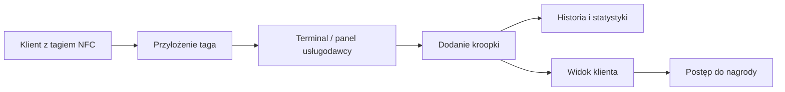

  <h1 align="center">Kroopka</h1>
  

    Nowoczesny system lojalnościowy oparty o <strong>tagi NFC</strong>,
    który zastępuje papierowe karty z pieczątkami.
  

  
  
  
  
  

---

O projekcie

[Kroopka](https://kroopka.com) to system benefitów dla stałych klientów, zaprojektowany dla usługodawców i lokali, które chcą odejść od papierowych kart lojalnościowych.
Zamiast tradycyjnej karty z pieczątkami klient otrzymuje wielorazowy tag NFC, który może przyłożyć do telefonu lub terminala. System zapisuje kolejne wizyty, nalicza „kroopki”, prezentuje postęp i pozwala odebrać nagrodę po osiągnięciu ustalonego progu.
Całość jest wspierana przez panel usługodawcy, w którym można zarządzać marką, kartami klientów, historią operacji, progami nagród i statystykami.

---

Jak to działa

Usługodawca wydaje klientowi tag NFC.
Przy kolejnych wizytach klient przykłada tag.
System nalicza kolejną kroopkę i zapisuje operację.
Klient może sprawdzić swój status i benefity na telefonie.
Po osiągnięciu celu otrzymuje nagrodę lub bonus ustalony przez markę.

---

Najważniejsze możliwości
<table>
  <tr>
    <td valign="top" width="50%">
      <h3>🏷️ Cyfrowa karta lojalnościowa</h3>
      
Jeden tag NFC zastępuje papierowe pieczątki i może być używany wielokrotnie.

    </td>
    <td valign="top" width="50%">
      <h3>📲 Szybka obsługa przy terminalu</h3>
      
Dodawanie kroopek odbywa się przez autoryzowany terminal lub panel, bez ręcznego liczenia.

    </td>
  </tr>
  <tr>
    <td valign="top" width="50%">
      <h3>🏪 Jeden tag, wielu partnerów</h3>
      
Ten sam tag może działać w różnych lokalach i branżach, a każda marka zachowuje własne zasady programu.

    </td>
    <td valign="top" width="50%">
      <h3>📊 Panel usługodawcy</h3>
      
Dashboard, historia operacji, zarządzanie kartami, ustawienia marki, progi nagród i statystyki w jednym miejscu.

    </td>
  </tr>
</table>

---

Dla kogo
Kroopka pasuje wszędzie tam, gdzie działa program stałego klienta i liczy się szybka obsługa:
salony beauty
fryzjerzy i barberzy
restauracje
kawiarnie
myjnie
lokalne punkty usługowe
marki budujące własny program benefitów

---

Co zyskuje usługodawca
prostszy i nowocześniejszy program lojalnościowy
mniej chaosu niż przy papierowych kartach
własne progi, nagrody i zasady naliczania
podgląd aktywności klientów i historii operacji
możliwość prowadzenia promocji, bonusów i akcji specjalnych
spójny panel do codziennej obsługi
Co zyskuje klient
jeden fizyczny tag zamiast wielu papierowych kart
szybkie sprawdzanie postępu i benefitów na telefonie
wygodne zbieranie kroopek przy każdej wizycie
czytelny status nagrody bez pytania obsługi

---

Główne obszary systemu
Panel usługodawcy
dashboard z podsumowaniem aktywnych kart i pieczątek
statystyki skanowań w czasie
szybkie akcje: skanowanie, rejestracja taga, zarządzanie kartami
historia operacji i filtrowanie zdarzeń
Obsługa tagów
rejestracja pustych tagów
skanowanie i dodawanie pieczątek
ręczna korekta liczby pieczątek
historia zmian dla każdego taga
Ustawienia marki
nazwa i slug marki
krótki oraz szczegółowy opis
konfiguracja liczby pieczątek do nagrody
logo i podgląd karty klienta
Doświadczenie klienta
podgląd aktualnego stanu kroopek
informacja o benefitach i progu nagrody
szybki dostęp po kodzie taga

---

Dlaczego Kroopka
Kroopka łączy prostotę tradycyjnych kart lojalnościowych z wygodą nowoczesnego, cyfrowego systemu:
łatwiej dla obsługi
czytelniej dla klienta
nowocześniej dla marki
skalowalnie dla wielu partnerów

---

Wizja

Budować lojalność klientów w prosty sposób — bez papieru, bez chaosu i bez zbędnych kroków.
Jedno tapnięcie. Jedna kroopka bliżej nagrody.
